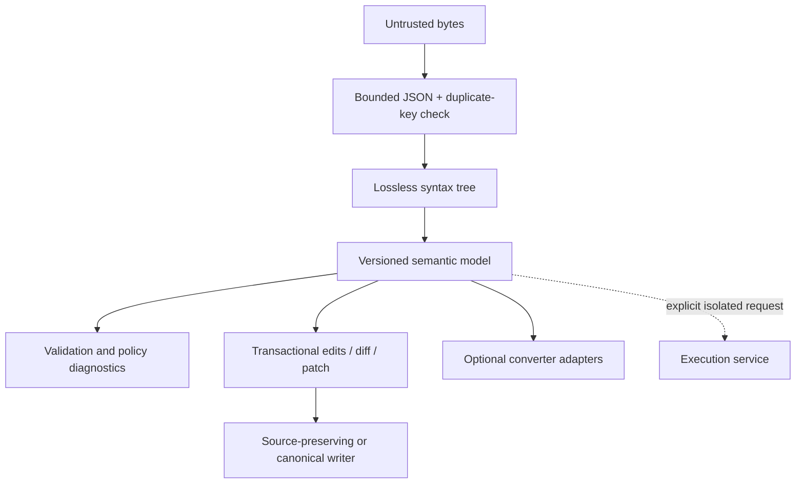

# Jupyter `.ipynb`: technical, ecosystem, interoperability, and product-opportunity analysis

**Research date:** 12 August 2026  
**Decision:** Conditional **GO** for a secure, loss-aware, cross-language notebook transformation toolkit; **NO-GO** for another undifferentiated Python parser or generic converter wrapper.  
**Evidence notation:** “Verified” means supported by a linked specification, primary repository, official product documentation, or dated registry snapshot. “Recommendation” and “estimate” identify engineering or product judgment. Commands below were checked against current documentation but **were not executed in the research environment**, which did not have the notebook toolchain installed.

## 1. Executive summary

An `.ipynb` file is a versioned JSON document containing an ordered list of cells, notebook and cell metadata, and—optionally—saved execution outputs. It is not a kernel, runtime, dependency lockfile, virtual environment, data bundle, or proof of reproducibility. Jupyter frontends edit the document; a separate kernel executes code through the Jupyter messaging protocol. A notebook can therefore be parsed, edited, indexed, rendered in a restricted way, or converted without executing it. [Jupyter’s content architecture](https://docs.jupyter.org/en/stable/projects/architecture/content-architecture.html) explicitly says the kernel does not know the notebook document; it receives code selected by the frontend.

The current **notebook file-format version is 4.5**. This must not be confused with the current Python `nbformat` package version, **5.11.0** on the research date. Format 4.5 made stable, unique cell IDs part of the schema; the official format description remains the normative starting point. [Format description](https://nbformat.readthedocs.io/en/latest/format_description.html) · [v4.5 JSON Schema](https://github.com/jupyter/nbformat/blob/main/nbformat/v4/nbformat.v4.5.schema.json) · [`nbformat` on PyPI](https://pypi.org/project/nbformat/)

`.ipynb` is a mainstream and stable computational-notebook standard, especially in data science, machine learning, research, education, and technical publishing. It is integrated into GitHub, VS Code, JupyterLab, Colab, Databricks, and many documentation systems. Public evidence does not justify a market-share percentage. Downloads are substantial—PyPI Stats reported 82.8 million `nbformat`, 65.1 million `nbconvert`, and 63.7 million `nbclient` downloads in the preceding month—but these include transitive installs, CI, and mirrors not captured uniformly. [PyPI Stats: `nbformat`](https://pypistats.org/packages/nbformat) · [`nbconvert`](https://pypistats.org/packages/nbconvert) · [`nbclient`](https://pypistats.org/packages/nbclient) · [methodology](https://pypistats.org/faqs)

The ecosystem already solves basic Python parsing and schema validation (`nbformat`), export (`nbconvert`), execution (`nbclient`), parameterized execution (Papermill), text pairing (Jupytext), and notebook-aware diff/merge (`nbdime`). The gap is fragmentation and uneven non-Python support—not absence of tools.

The strongest product is a combination of:

- a Rust core with a CLI and Python/TypeScript bindings first, followed by Go/.NET/Java integrations;
- dual source-preserving and canonical JSON modes;
- layered schema, semantic, security, platform-profile, and conversion-fidelity diagnostics;
- deterministic, atomic transformations that retain unknown fields;
- ID-aware diff, merge, and patch operations;
- safe rich-content inspection/sanitization and secret-scanning hooks;
- bounded-memory handling and lazy binary decoding;
- adapters to Jupytext and selected converters; and
- execution as an isolated, optional component—not part of the parsing core.

Defensible differentiation would come from **cross-language parity, security/governance, low-noise editing, fidelity reports, and a unified transaction pipeline**. A Python-only clone of `nbformat`, an attempt to implement every kernel or renderer, or a promise of universal byte-for-byte preservation after arbitrary semantic edits would create little value or unsustainable scope.

## 2. `.ipynb` fundamentals

### 2.1 Document, application, and runtime are different layers

“IPYNB” is the historical “IPython Notebook” filename extension. The format survived the broader Jupyter transition and is language-neutral. The relevant layers are:

| Layer | Responsibility | Contained in `.ipynb`? |
|---|---|---:|
| Notebook document | Cells, metadata, saved outputs, format version | Yes |
| Frontend | Editing, rendering, UI state, choosing code to run | No |
| Jupyter Server | Content APIs, persistence, authentication, kernel management | No |
| Kernel | Executes one language and sends results/messages | No |
| Runtime and packages | Python/R/Julia/etc., libraries, system dependencies | No |
| Jupyter messaging | Wire protocol between clients and kernels | No |
| External data and secrets | Files, databases, tokens, environment variables | Usually no; references or accidental copies may occur |

JupyterLab, classic Notebook, VS Code, and cloud products are applications around the format. A kernel is an independent process. Kernel implementations use a language runtime and communicate over Jupyter channels; the authoritative protocol is documented by `jupyter_client`. [Jupyter overview](https://docs.jupyter.org/en/latest/what_is_jupyter.html) · [kernel model](https://docs.jupyter.org/en/stable/projects/kernels.html) · [messaging protocol](https://jupyter-client.readthedocs.io/en/latest/messaging.html)

JSON makes notebooks portable, inspectable with ordinary tools, extensible through metadata, and naturally suited to MIME-keyed output objects. It also creates drawbacks: large base64 strings, noisy diffs, duplicate-key ambiguity, and no intrinsic comments, binary chunking, or environment model.

### 2.2 Top-level structure and multiline text

A current notebook has four required top-level fields:

```json
{
  "cells": [],
  "metadata": {},
  "nbformat": 4,
  "nbformat_minor": 5
}
```

`nbformat` is the major document version; `nbformat_minor` is the compatible minor revision. Multiline `source`, text streams, and tracebacks may be serialized either as one string or as a list of strings. Readers must join arrays without inventing separators; writers may normalize to a string. Source-preserving software must remember the original representation. These rules and the structures below are defined by the [official format description](https://nbformat.readthedocs.io/en/latest/format_description.html).

### 2.3 Cells

| Cell | Required/core fields | Meaning |
|---|---|---|
| Markdown | `cell_type: "markdown"`, `metadata`, `source`, and in 4.5 `id`; optional `attachments` | CommonMark-like prose plus Jupyter-supported extensions and embedded attachments |
| Code | `cell_type: "code"`, `metadata`, `source`, `execution_count`, `outputs`, and in 4.5 `id` | Source for the selected kernel and saved result messages |
| Raw | `cell_type: "raw"`, `metadata`, `source`, and in 4.5 `id`; optional `attachments` | Unprocessed material for a downstream converter, often controlled by `metadata.format` |

Format 4 removed v3 “heading” cells; headings are Markdown. Since 4.5 every cell has an `id`: 1–64 ASCII letters, digits, `_`, or `-`, unique within the notebook. IDs support identity through edits, merges, and collaborative workflows. Older notebooks can be upgraded by generating IDs, but that is a semantic change that should be reported. [Cell-ID JEP 62](https://jupyter.org/enhancement-proposals/62-cell-id/cell-id.html)

Common standardized cell metadata includes `tags`, `collapsed`, `scrolled`, `deletable`, `editable`, `name`, raw-cell `format`, `jupyter.source_hidden`, and `jupyter.outputs_hidden`. Slideshow tools conventionally use `metadata.slideshow.slide_type`. Tool-specific metadata is allowed and should be namespaced and preserved. “Recognized by popular software” is not the same as “required by the schema.”

### 2.4 Notebook metadata, kernels, and languages

Notebook metadata is an extensibility object. Widely recognized fields include:

- `kernelspec`: typically `name`, `display_name`, and `language`; it helps select a separately installed kernelspec but does not carry the kernel.
- `language_info`: descriptive fields such as language `name`, `version`, file extension, MIME type, and syntax-highlighting mode.
- `widgets`: serialized widget-manager state used for static restoration or reconnection by compatible frontends.
- tool namespaces such as `jupytext`, `colab`, `vscode`, `papermill`, or `toc`.

The notebook may state “Python 3,” but that does not guarantee the Python executable, package versions, OS libraries, data, working directory, environment variables, or credentials exist. A `kernel.json` lives outside the notebook and defines a launch command (`argv`), display name, language, and optionally environment settings. [Kernelspec discovery and files](https://jupyter-client.readthedocs.io/en/latest/kernels.html)

### 2.5 Outputs and MIME bundles

Code-cell `outputs` are an ordered array:

| Output type | Core fields | Notes |
|---|---|---|
| `stream` | `name` (`stdout`/`stderr`), `text` | Captured process text; may be string or list of strings |
| `execute_result` | `execution_count`, `data`, `metadata` | Result of an execution request, usually the final expression |
| `display_data` | `data`, `metadata` | Rich display independent of the final result |
| `error` | `ename`, `evalue`, `traceback` | Saved error and terminal-formatted traceback |

A MIME bundle maps MIME types to representations, for example `text/plain`, `text/html`, `image/png`, `image/svg+xml`, or `application/vnd.jupyter.widget-view+json`. JSON MIME values are JSON values; PNG/JPEG and other binary values are base64 strings. A frontend chooses a supported representation; presence of HTML or JavaScript does not authorize executing it. Output metadata can guide renderers, but remains untrusted input.

Markdown and raw cells may have `attachments`, each a filename-like key mapped to a MIME bundle and referenced as `attachment:name.png`. Attachments are data inside the JSON, not automatically filesystem-safe names. Extractors must assign safe paths rather than trusting keys.

Interactive widgets are split between document state and live kernel state. Saved widget state can permit static reconstruction, but live interaction normally requires the matching widget manager, JavaScript modules, comm messages, and often a running kernel. Widget state may contain sensitive values; the ipywidgets documentation specifically warns that a password widget’s value is saved in plaintext when widget state is stored. [Widget embedding](https://ipywidgets.readthedocs.io/en/7.x/embedding.html) · [widget list/password warning](https://ipywidgets.readthedocs.io/en/latest/examples/Widget%20List.html)

### 2.6 Execution counts and reproducibility

`execution_count` is an integer or `null`; result outputs may have a corresponding count. Counts describe the recorded interactive session, not a dependency graph or guarantee of order. Users can run cells repeatedly or out of order, mutate hidden kernel state, access the network, read undeclared files, or depend on randomness and wall-clock time. Saved output shows what was recorded, not that the current source recreates it.

Accordingly:

- a notebook is not a virtual environment or execution environment;
- it normally contains neither dependencies nor input datasets;
- it can contain credentials accidentally in source, metadata, URLs, outputs, or tracebacks;
- output presence does not imply reproducibility;
- viewing or editing does not require execution;
- JSON syntax validity does not imply notebook-schema validity; and
- schema validity implies neither safe rendering nor safe execution.

## 3. Notebook-format version history

Dates below describe the documented specification or reference-package era, not a promise that every frontend adopted the revision that day. Early notebook history is unevenly tagged; those dates are marked approximate. The [legacy IPython documentation](https://ipython.org/ipython-doc/3/notebook/nbformat.html), current [format changelog](https://nbformat.readthedocs.io/en/latest/changelog.html), schemas, and [cell-ID JEP](https://jupyter.org/enhancement-proposals/62-cell-id/cell-id.html) are the primary evidence.

| Format | Publication / practical era | Material changes | Compatibility and recommended policy |
|---|---|---|---|
| v1–v2 | 2011–2012, approximate | Early IPython notebook models; pre-current cell/output structure | **Read only if legacy migration is a product requirement.** Upgrade through the reference implementation; never write for new work. |
| v3 | IPython 1.x–2.x, 2013–2014 | Top-level `worksheets`; `heading` cells; code `input`/`prompt_number`; outputs such as `pyout`, `display_data`, `stream`, `pyerr`; MIME fields distributed differently | **Read and upgrade.** Preserve a migration report. Reject only under an explicit current-only policy. New writes are unjustified. |
| v4.0 | Jupyter/IPython 3 transition, 2015 | Flattened worksheets into top-level `cells`; heading → Markdown; code `source`, `execution_count`; outputs renamed `execute_result`/`error`; MIME bundles consolidated | **Read.** Write 4.5 by default. Upgrade is normally safe but may add fields/IDs. Downgrade to v3 is structurally lossy. |
| v4.1 | 2016 reference-package era | Attachments on Markdown and raw cells | **Read/preserve.** Older readers may preserve but not render new attachment fields. |
| v4.2 | Dec. 2016 reference release | JSON output values may be any JSON-compatible value; `application/*+json`; notebook `authors` metadata | **Read/preserve.** Strict 4.0/4.1 validators historically rejected some notebooks that used these later shapes under older headers. |
| v4.3 | Feb. 2017 reference release | Schema/validation refinements, including clearer MIME-bundle behavior | **Read/preserve.** Use the declared schema plus pragmatic compatibility diagnostics. |
| v4.4 | 2017–Jan. 2020 rollout/documentation | Official `metadata.jupyter`; `source_hidden` and `outputs_hidden`; schema refinements | **Read/preserve.** Hiding is a presentation hint, not redaction. |
| v4.5 | JEP approved Sept. 2020; frontend rollout 2021 | Required, unique cell `id` values with constrained syntax | **Current write target.** Generate IDs on upgrade; validate uniqueness; preserve stable IDs across edits. |

The current schema is [v4.5](https://github.com/jupyter/nbformat/blob/main/nbformat/v4/nbformat.v4.5.schema.json). `nbformat`’s Python API converts between **major** versions and validates against the declared version; package releases and document revisions have independent numbers. [`nbformat` API](https://nbformat.readthedocs.io/en/latest/api.html)

### 3.1 Version policy

Major-version changes can restructure the document. Minor revisions are designed to add backward-compatible fields, cell types, or output types. An older reader may process a newer minor notebook only if it follows the compatibility rule: preserve unknown fields and unknown cell/output types even if it cannot render them. Silently deleting unknown content is data loss.

Recommended policy:

1. Parse JSON with limits and duplicate-key detection before schema interpretation.
2. Reject an unknown future **major** version by default; offer opaque inspection, not mutation.
3. For a future v4 minor, preserve unknown fields/variants, warn that support is partial, and refuse transformations that would discard them.
4. Read v3 when migration matters, then explicitly upgrade to v4.5 with a report of worksheet flattening, heading conversion, output remapping, and generated IDs.
5. Write 4.5 for new notebooks unless a named platform profile requires otherwise.
6. Downgrade only on explicit request, produce a loss report, and fail if the caller selected “no loss.”

The need for pragmatic diagnostics is real: the `nbformat` project documented notebooks declaring 4.0/4.1 while containing later JSON MIME structures, a consequence of historically permissive validation. [Strict-validation compatibility issue](https://github.com/jupyter/nbformat/issues/170)

## 4. Product-development use cases

“Core” below means document-only logic. “Adapter” means an optional external-tool integration. “Service” means a separately isolated execution or untrusted-rendering boundary.

| Use case and benefit | Fields/conventions | External dependency | Executes? | Security/fidelity boundary | Product layer |
|---|---|---|---:|---|---|
| Static viewer / documentation embed | cells, MIME bundles, attachments, metadata | renderer/sanitizer | No | HTML/SVG/widgets must be sanitized or blocked; unsupported MIME falls back | Core + safe-render adapter |
| Editor / programmatic creation | cells, IDs, metadata, outputs | frontend optional | No | Preserve unknowns and stable IDs; editing rich outputs can invalidate trust | Core |
| Cell insert/delete/move/filter | ordered cells, IDs | none | No | Index-based edits are merge-fragile; ID-aware operations preferred | Core |
| Generate tutorials/reports/demos | code/Markdown/raw, tags, kernel metadata | templates; converter for publication | Usually no | Generated source is not verified output; conversion can discard metadata | Core + adapter |
| Validate uploaded notebooks | versions, schema, MIME, attachments | official schemas | No | Validation is not sanitization; impose size/depth limits | Core |
| Clean before commit/share | outputs, counts, metadata, attachments | secret scanner optional | No | Stripping output misses secrets in source/metadata; report every removal | Core |
| Automated execution | code, kernelspec, working directory hints | kernels, runtime, `nbclient` | **Yes** | Arbitrary code; isolate OS, network, credentials, storage, CPU/RAM/time | Separate service |
| Parameterized runs / scheduled reports | tagged parameters cell, Papermill metadata | Papermill, scheduler, runtime | **Yes** | Injection, secrets, environment drift, stale outputs | Adapter + service |
| Revision comparison | IDs, source, outputs, metadata | language parsers optional | No | Large/binary output noise; semantic diff is language-specific | Core |
| Concurrent merge | stable IDs, cell order, fields | none | No | Conflicts need explicit reporting; never silently choose executable code | Core |
| Extract code/prose/output/assets | cells, MIME bundles, attachments | filesystem writer | No | Path traversal, active content, base64 bombs; provenance may be lost | Core |
| Publish HTML/PDF/DOCX/slides | Markdown/raw/output MIME, tags/slideshow | `nbconvert`, Quarto, Pandoc, TeX/browser | No, unless requested | Mostly render-only; CSS/JS/fonts/external resources affect result | Adapter/service |
| Reproducible ML/data pipeline | source, parameters, execution result | environment lock, datasets, orchestrator, kernel | **Yes** | Notebook alone omits most reproducibility inputs; restart-and-run-all needed | Separate workflow/service |
| Educational grading | source, IDs/tags, hidden/reference metadata by convention | sandboxed kernel, test harness | Usually yes | Student code is hostile input; prevent data exfiltration and grader tampering | Profile + service |
| Organization policy enforcement | metadata, MIME, sizes, tags | policy plugins | No | Policy and format validity must remain separate diagnostics | Core/plugin |
| Index/search | source, metadata, text outputs | search index | No | PII/secrets may be indexed; active content should remain inert | Core + application |
| Secret/PII/unsafe-content detection | all text, decoded URLs, metadata, outputs | scanning engines | No | False positives/negatives; do not deserialize arbitrary metadata extensions | Plugin |
| Cross-platform migration | core schema plus platform namespaces | source/destination adapters | No/optional | Platform metadata, widgets, magics, runtimes and assets rarely round-trip | Adapter |

## 5. Execution and kernel boundaries

Execution requires much more than a valid file:

1. Resolve a kernelspec by `metadata.kernelspec.name`, user choice, or policy.
2. Locate/install its language runtime and packages.
3. Choose a working directory and mount the expected files/data.
4. Launch the kernel from `kernel.json` and create authenticated connection information.
5. Establish Shell, IOPub, stdin, Control, and Heartbeat channels under the Jupyter messaging protocol.
6. Send code cells—normally in document order for “run all”—and capture streams, display data, execution results, errors, comm/widget traffic, and execution counts.
7. Enforce timeouts, interrupt/cancel policy, kernel-death handling, output limits, and cleanup.

The frontend or execution client decides cell order. Counts record history, not scheduling constraints. A reliable verification run should start a clean kernel and execute all cells in order; even then network services, random seeds, hardware, clocks, package resolution, mutable datasets, and external state can make results nondeterministic.

[`nbclient`](https://nbclient.readthedocs.io/en/latest/client.html) is the reference-style Python execution client: it launches a kernel, executes cells, records outputs, supports timeouts/error policies/hooks, and can store widget state. [`nbconvert`](https://nbconvert.readthedocs.io/en/latest/execute_api.html) can invoke execution before export. [Papermill](https://papermill.readthedocs.io/en/latest/usage-execute.html) adds parameter injection, run metadata, and input/output paths. These are execution/orchestration capabilities, not properties of JSON.

Documentation-verified command examples, not run here:

```bash
jupyter execute notebook.ipynb
jupyter nbconvert --execute --to notebook --inplace notebook.ipynb
papermill input.ipynb output.ipynb -p alpha 0.6
```

**Recommendation:** keep execution out of the manipulation library’s core. Define an adapter interface that writes an immutable input snapshot and sends it to a separate process or service. The service should use a fresh, least-privilege environment; read-only inputs; an ephemeral working directory; CPU, memory, process, disk, output, and time limits; restricted network; scoped credentials; explicit cancellation; and a tamper-evident run record. Parsing safely does not make code, magics, shell escapes, native extensions, deserializers, or rich output safe.

## 6. Language, framework, and platform-support matrix

Legend: **F** full/core support, **P** partial or platform-profile support, **A** available through an adapter/external component, **—** not its purpose. “Full” never means it reproduces every vendor extension.

| Implementation | Language / status | Read-write & validate | Render / convert | Execute | Diff / merge | Trust / sanitize | Important boundary |
|---|---|---|---|---|---|---|---|
| [`nbformat`](https://github.com/jupyter/nbformat) | Python; official, BSD-3-Clause | **F / F** | — | — | — | signature API, not safe rendering | Reference model/schema/conversion between major versions; ordinary serialization is not a lossless JSON editor |
| Jupyter Notebook / JupyterLab | TS/JS + Python; official | **F / F** through stack | **F / A** | **F** | extensions / Git UI | trust-aware frontend | Application, server, and kernels—not one format library |
| [`nbconvert`](https://nbconvert.readthedocs.io/en/latest/) | Python; official, BSD-3-Clause | **A** via `nbformat` | **F** export | **A** via `nbclient` | — | configurable HTML sanitization | Publication/export pipeline; most outputs are not reversible |
| [`nbclient`](https://nbclient.readthedocs.io/en/latest/) | Python; official, BSD-3-Clause | **A** | — | **F** | — | — | Execution client, not sandbox |
| [`nbdime`](https://github.com/jupyter/nbdime) | Python/JS; official Jupyter, BSD-3-Clause | **A** | diff UI | — | **F** | — | Notebook-aware diff/merge; narrower than governance/security suite |
| [Jupytext](https://github.com/jupytext/jupytext) | Python; mature third party, MIT | **F** for paired models | text conversion | optional hooks | text-Git workflow | — | Text formats omit outputs; pairing retains `.ipynb` as output carrier |
| [Papermill](https://github.com/nteract/papermill) | Python; mature, BSD-3-Clause | **A** | — | **F**, parameterized | — | — | Orchestrates kernels; no isolation guarantee |
| [Voilà](https://voila.readthedocs.io/en/stable/using.html) | Python/JS; Jupyter ecosystem | **A** | notebook → app | **F** for live widgets | — | deployment policy | Executes notebook and serves output; not a structural converter |
| [Quarto](https://quarto.org/docs/get-started/authoring/jupyter.html) | multi-language CLI | **P** | **F** publication | optional | text-oriented | renderer-dependent | Converts notebook content through Markdown/Pandoc; notebook metadata may be lost |
| [MyST](https://mystmd.org/guide/notebooks-with-markdown) / Jupyter Book | Python/TS publishing | **P** | **F** sites/docs | optional | text-oriented | renderer-dependent | Treats notebooks as publication inputs, not a general conformance implementation |
| [VS Code Notebook API](https://code.visualstudio.com/api/extension-guides/notebook) | TypeScript; official VS Code | serializer/controller model; `.ipynb` through Jupyter extension | **F** | **F** through controllers | source control integrations | renderer isolation policy | API abstracts many notebook types; it is not itself an `nbformat` validator |
| [Google Colab](https://research.google.com/colaboratory/intl/en-GB/faq.html) | hosted platform | `.ipynb` import/export | **F** | **F** cloud VM | comments/history | platform controls | Notebook file transfers; VM, custom files, and libraries are not included |
| Kaggle Notebooks | hosted platform | import/export/profile support | **F** | **F** managed runtime | platform versions | platform controls | Runtime, dataset mounts, accelerators, and metadata are Kaggle-specific; import is not full implementation evidence |
| [Databricks](https://docs.databricks.com/aws/en/notebooks/notebook-export-import) | hosted platform | `.ipynb`, source, HTML, DBC, RMarkdown import/export | **F** platform view | **F** cluster/serverless | Git/platform | platform controls | Magics, cells, resources, and platform metadata can change; `.ipynb` uploads have documented limits |
| [GitHub renderer](https://docs.github.com/en/repositories/working-with-files/using-files/working-with-non-code-files) | hosted static view | read-only | **P** static HTML | — | ordinary Git diff | custom JS disabled | Read-only rendering; GitHub directs interactive use to nbviewer/a server |
| [nbviewer](https://nbviewer.org/) | hosted/static renderer | read-only | **F** static view | — | — | service policy | Rendering service, not editor or execution environment |
| [Binder](https://mybinder.readthedocs.io/en/latest/introduction.html) | hosted build/launch | repository content | browser environment | **F** ephemeral | — | deployment isolation | Builds an environment from repository configuration; not a notebook-format implementation |
| marimo | Python; mature alternative | imports/exports with loss limits | app/static outputs | reactive Python | source-code Git | app sandbox responsibility | Native artifact is a Python program, not `.ipynb` |
| Pluto.jl | Julia; mature alternative | migration only | notebook UI/export | reactive Julia | text `.jl` | runtime responsibility | Native reactive model and embedded Julia environment differ fundamentally |

### 6.1 Standalone library support by programming language

| Ecosystem | Evidence-backed assessment | Product implication |
|---|---|---|
| Python | Dominant and mature: `nbformat`, `nbconvert`, `nbclient`, `nbdime`, Jupytext, Papermill, lint/clean tools | Another parser has almost no differentiation. Python bindings remain essential. |
| JavaScript/TypeScript | Strong application-level models in JupyterLab and VS Code; renderer and UI ecosystem is mature. Standalone, conformance-focused, source-preserving APIs are less unified. | Offer Node/WASM bindings; do not try to replace JupyterLab’s document model. |
| Rust | The [`nbformat` crate](https://crates.io/crates/nbformat) exists but registry adoption was nascent at the research date. | Strong core opportunity: memory safety, predictable binaries, WASM/FFI, performance; ecosystem-building cost is real. |
| Go | [`github.com/jmnote/nbformat`](https://pkg.go.dev/github.com/jmnote/nbformat) supports v4.0–4.5 and advertises bidirectional structures. | Existing support reduces “first parser” value, but policy/security/diff capabilities remain an opening. |
| Java | Generic JSON and platform-specific readers exist; no reference-equivalent, broadly adopted standalone suite was found in this evidence scan. | A stable JVM binding/API would serve build systems, IDEs, and enterprise ingestion. This is a scan result, not proof of absence. |
| C#/.NET | [`NBFormat.NET`](https://github.com/fslaborg/NBFormat.NET) is a small F# v4 parser; .NET notebook platforms have their own models. | Meaningful gap for a supported NuGet-grade binding with conformance and policy tooling. |
| R | Jupyter kernels and R Markdown/Quarto workflows are mature; direct format manipulation commonly routes through JSON/Python tooling. | R binding useful for publishing/governance, but lower first-wave priority than Python/Node. |
| Julia | IJulia reads/writes through Jupyter; Pluto is a native alternative. Standalone `.ipynb` transformation is not a core Julia strength. | Binding useful for migration, but preserve kernel-language source without pretending to understand Julia semantics. |

## 7. Conversion and fidelity matrix

### 7.1 Classification

1. **Lossless:** all document semantics and content survive a tested round trip.
2. **Conditionally lossless:** lossless only under declared constraints, profiles, or paired-source rules.
3. **Semantically equivalent:** intended code/prose meaning survives, but representation, metadata, IDs, outputs, or ordering detail may change.
4. **Render-only:** a view/publication artifact; reliable reconstruction is not expected.
5. **Lossy:** important notebook semantics are predictably discarded or require manual reconstruction.

No classification implies byte-for-byte equality. “Yes” in a preservation column means the principal representation supports it; **partial** means only some variants or an auxiliary directory/file does.

| Format / workflow | From `.ipynb` | To `.ipynb` | Tool / type | Code | Markdown | Outputs | Metadata | Interaction | Class | Major limitation |
|---|---:|---:|---|---:|---:|---:|---:|---:|---:|---|
| `.ipynb` copy | Yes | Yes | byte copy | Yes | Yes | Yes | Yes | saved state only | 1 | Only literal copy preserves bytes; it does not validate or migrate |
| `.ipynb` parse/write | Yes | Yes | `nbformat` / structural | Yes | Yes | Yes | mostly | saved state only | 2 | Key order, whitespace, multiline representation, defaults, and unknown variants may change |
| HTML | Yes | No reliable reverse | `nbconvert`, Quarto / render | visible | rendered | rendered | little | usually no | 4 | Source structure, IDs, metadata, alternate MIME, and live kernel state are not recoverable |
| PDF / WebPDF | Yes | No | `nbconvert`, Quarto / render | visible | rendered | rendered | no | No | 4 | Pagination/rasterization/font changes; PDF is a terminal publication form |
| Markdown (`.md`) | Yes | Conditional | `nbconvert`, Pandoc / export or structural | fenced | Yes | partial/external | partial | No | 3–5 | No universal cell/metadata/output convention |
| MyST Markdown | Yes | Yes, constrained | Jupytext/MyST / textual notebook | Yes | Yes | optional/partial | partial | limited | 2–3 | Round trip depends on front matter and cell-directive conventions |
| Quarto Markdown (`.qmd`) | Yes | Yes, constrained | `quarto convert` / structural | Yes | Yes | often dropped/recomputed | partial | output-dependent | 3 | Publishing options and executable-cell syntax do not map one-to-one |
| reStructuredText | Yes | Conditional | `nbconvert`/Pandoc | fenced | transformed | partial | little | No | 5 | Cell boundaries and notebook metadata are not native concepts |
| Python script | Yes | Conditional | `nbconvert` or Jupytext | Yes | comments/markers | No | partial | No | 2–5 | Jupytext percent pairing can preserve input structure; plain export cannot preserve outputs |
| R/Julia/other script | Yes | Conditional | Jupytext percent/light | Yes | comments/markers | No | partial | No | 2–5 | Correct comment syntax and cell markers are language/profile dependent |
| Jupytext percent | Yes | Yes | Jupytext / textual pairing | Yes | Yes | No in text; yes in paired ipynb | useful subset | No | 2 | Conditionally lossless for inputs; output remains in paired `.ipynb` |
| Jupytext light | Yes | Yes | Jupytext / textual pairing | Yes | Yes | No | subset | No | 2–3 | Ambiguous boundaries and prose/comment transformations in edge cases |
| LaTeX | Yes | No reliable reverse | `nbconvert` / render | typeset | typeset | typeset | little | No | 4 | Requires Pandoc/TeX stack and templates; notebook model disappears |
| Reveal.js slides | Yes | No | `nbconvert` / render | visible | visible | visible | slideshow subset | browser only | 4 | Uses slideshow metadata but output is a presentation, not a notebook |
| AsciiDoc | Yes | Conditional via Pandoc | `nbconvert`/Pandoc | fenced | transformed | partial | little | No | 5 | No standard mapping for outputs, IDs, attachments, or notebook metadata |
| DOCX | Yes | Conditional reconstruction | Quarto/Pandoc | visible | transformed | rendered | little | No | 4 | Office document structures are publication-oriented, not executable-cell models |
| EPUB | Yes | No reliable reverse | Quarto/Pandoc | visible | transformed | rendered | publication metadata | No | 4 | Fixed publication package; kernels/widgets and notebook identity lost |
| Pandoc JSON AST | Yes | Yes, constrained | Pandoc / structural bridge | Yes | Yes | partial | partial | No | 3 | Pandoc’s AST cannot represent all notebook/tool metadata or live semantics |
| Jupyter Book | Input | Can retain source ipynb | MyST/Jupyter Book / publication | Yes | Yes | rendered/rebuilt | publishing subset | limited | 3–4 | A book project is not a notebook format; build configuration/assets are external |
| R Markdown (`.Rmd`) | Conditional | Conditional | Jupytext/Pandoc/Databricks | Yes | Yes | usually recomputed | partial | framework-specific | 3–5 | Chunk options, R environments, and output document model differ |
| Databricks source/DBC | Platform export | Platform import | Databricks migration | mostly | mostly | varies | platform-specific | varies | 3–5 | Magics, runtime, jobs, widgets, resources, and DBC archive semantics differ |
| Zeppelin | Extract/rebuild | Extract/rebuild | custom migration | partial | partial | partial | poor | No | 5 | Paragraph/interpreter model has no reliable standard round trip |
| Observable | Extract/rebuild | Extract/rebuild | custom; Observable Framework conversion is not an ipynb bridge | rewritten | rewritten | rebuilt | poor | different model | 5 | Reactive JavaScript dataflow and cells differ fundamentally |
| VS Code notebook model | Yes | Yes through Jupyter extension | platform serializer | Yes | Yes | mostly | platform + core | renderer-dependent | 2–3 | Generic Notebook API is broader than `nbformat`; extension metadata may not port |
| Colab | Yes | Yes | platform import/export | Yes | Yes | mostly | Colab extras | limited | 2–3 | VM, files, libraries, secrets, comments, and platform state are separate |
| marimo Python | Import/translate | Export `.ipynb` | platform migration | rewritten | partial | recomputed/exported | poor | different model | 3–5 | Reactive dependency model and Python app source cannot round-trip exactly |
| Pluto `.jl` | Extract/rebuild | Extract/rebuild | custom migration | rewritten | partial | recomputed | different | different model | 5 | Reactive Julia graph and embedded environment have no direct notebook equivalent |

[`nbconvert` documents](https://nbconvert.readthedocs.io/en/latest/usage.html) HTML, LaTeX/PDF/WebPDF, Reveal.js, Markdown, AsciiDoc, reStructuredText, script, and notebook exports. Pandoc is required for several markup paths, XeTeX for traditional PDF, and a browser stack for WebPDF. [Installation dependencies](https://nbconvert.readthedocs.io/en/latest/install.html) The [Quarto Jupyter workflow](https://quarto.org/docs/get-started/authoring/jupyter.html) can render notebooks to HTML/PDF/DOCX and other publication forms; by default it uses saved notebook content unless execution is requested. [Jupytext formats](https://jupytext.readthedocs.io/en/latest/formats-scripts.html) explicitly distinguish text inputs from outputs retained in paired notebooks.

Documentation-verified, unexecuted examples:

```bash
jupyter nbconvert --to html notebook.ipynb
jupyter nbconvert --to markdown notebook.ipynb
jupyter nbconvert --to slides notebook.ipynb
jupytext --to py:percent notebook.ipynb
jupytext --to ipynb notebook.py
quarto convert notebook.ipynb
quarto convert notebook.qmd
quarto render notebook.ipynb --to docx
pandoc notebook.ipynb -o notebook.docx
```

### 7.2 What commonly survives

- Code and Markdown usually survive structural/text conversions, but cell boundaries, magics, language-specific comments, and raw cells may not.
- Execution counts, error tracebacks, alternate MIME representations, output metadata, IDs, tags, slideshow hints, attachments, and vendor metadata often disappear outside `.ipynb` or a deliberately paired format.
- Images may become external files, data URLs, rasterized document content, or be omitted. An exporter must report the chosen representation and filename mapping.
- HTML, SVG, JavaScript, iframes, widgets, and custom MIME renderers depend on frontend policy. Static HTML/PDF cannot preserve a live comm channel.
- External files, datasets, runtimes, and secrets are not pulled into a conversion merely because source refers to them.

Every adapter should produce a machine-readable fidelity report listing preserved, transformed, externalized, regenerated, unsupported, and discarded items. Round-trip claims should be fixture-tested per tool/version/profile rather than inferred from a successful command.

## 8. Security and trust analysis

An `.ipynb` is an untrusted compound document: executable source plus potentially active rich output plus extensible metadata. The safest default is inert parsing and plain-text rendering.

### 8.1 Trust is local display policy, not provenance

Jupyter computes a signature over selected notebook content using a local secret and stores the signature in a local database. When content changes, the signature no longer matches. A signature says that a local user previously marked those outputs trusted; it does **not** prove authorship, origin, reproducibility, malware absence, or safety in another renderer, and it is not normally portable between machines/users. Markdown HTML/JavaScript remains subject to frontend security rules. [Jupyter Server security model](https://jupyter-server.readthedocs.io/en/latest/operators/security.html)

The practical risk is not theoretical. [CVE-2026-44727 / GHSA-fcw5-x6j4-ccmp](https://github.com/advisories/GHSA-fcw5-x6j4-ccmp) describes stored cross-site scripting in Jupyter Server notebook conversion handlers before 2.20, arising from notebook HTML rendering without an adequate sandbox/CSP in combination with non-sanitizing export behavior; impact could extend to actions available to the authenticated notebook user. This demonstrates that schema-valid rich output plus a trusted product stack can still cross a security boundary.

### 8.2 Threats and controls

| Threat | Example impact | Required default/control |
|---|---|---|
| Code, magics, `!` shell commands | arbitrary file/network/process access | Never execute during parse, inspect, validate, transform, diff, convert, or safe render; isolate explicit execution |
| HTML/JS/SVG/custom MIME | XSS, credential/action theft, renderer exploit | MIME allowlist; sanitize HTML and SVG; no script/event handlers; sandbox iframes; disable unknown renderers |
| External links/images/fonts | tracking, SSRF in server-side conversion, data exfiltration | Disable network fetch by default; URL scheme/host policy; proxy with limits if enabled |
| Widget state/comms | secrets in state; untrusted module loading; live kernel actions | Inspect as JSON only; module allowlist; strip sensitive state; no comm activation in safe mode |
| Secrets/PII | leakage through source, output, tracebacks, metadata, URLs | Scan every textual location and decoded structured payload; redact through explicit policy and audit report |
| Huge base64/output arrays | memory/disk exhaustion and decompression bombs | Total/file/field/string/output limits; lazy decode; decoded-size precheck; bounded extraction |
| Deep/malformed JSON | parser stack/CPU exhaustion | depth, token, nesting, key-count and time limits; iterative/streaming parser where practical |
| Duplicate keys | validator/parser disagreement; policy bypass | Reject by default. RFC 8259 says object names should be unique and notes unpredictable behavior otherwise. [RFC 8259 §4](https://datatracker.ietf.org/doc/html/rfc8259#section-4) |
| Attachment/output extraction | `../` traversal, overwrite, unsafe filenames | Ignore supplied path semantics; generate safe names; confine to a new directory; no symlink following; atomic exclusive creation |
| Converter templates/filters | template injection, shell/process use, vulnerable Pandoc/TeX/browser | Pin and isolate converters; trusted templates only; restricted filesystem/network; sanitize before and after as appropriate |
| Extension metadata | unsafe deserialization or plugin dispatch | Treat metadata as data; schema plugin opt-in; never instantiate arbitrary classes or execute handlers by type name |

Recommended parser defaults are duplicate-key rejection, UTF-8 validation, no network, no extraction, no base64 decode until requested, configurable byte/depth/key/cell/output limits, and diagnostics that identify JSON Pointer, severity, rule ID, and remediation. A safe-render profile should begin with escaped text, a small MIME allowlist, HTML/SVG sanitization aligned with the [OWASP XSS guidance](https://cheatsheetseries.owasp.org/cheatsheets/Cross_Site_Scripting_Prevention_Cheat_Sheet.html), no arbitrary JavaScript, no remote resources, sandboxed frames, and renderer version reporting.

Output stripping reduces repository noise and one leakage channel. Signing helps local trust UX. Schema validation catches structural errors. **None is a complete security solution.**

## 9. OSS adoption analysis with dated evidence

### 9.1 Measured signals

| Signal | Dated result | What it supports | Limitation |
|---|---:|---|---|
| PyPI downloads, preceding month at 12 Aug. 2026 | `nbformat` **82,787,028**; `nbconvert` **65,096,952**; `nbclient` **63,683,660**; `jupyter` **18,029,271** | Very broad installation footprint for the Python/Jupyter stack | Includes transitive dependencies, CI, repeated environments; excludes some mirrors; not users or market share. [PyPI Stats FAQ](https://pypistats.org/faqs) |
| Adjacent package downloads | Papermill **11,116,973** and Jupytext **3,850,250** in displayed monthly snapshots | Material automation and text-pairing ecosystems | Snapshots may be crawled on different dates and include automated installs. [Papermill](https://pypistats.org/packages/papermill) · [Jupytext](https://pypistats.org/packages/jupytext) |
| Public GitHub collection, Oct. 2020 | JetBrains/Datalore reported downloading **9.72 million** notebooks, versus 1.23 million in its earlier comparison | Millions of public artifacts and strong historical growth | Generated, forked, copied, course, and vendored files; collection/query methodology determines count. [Study write-up](https://blog.jetbrains.com/datalore/2020/12/17/we-downloaded-10-000-000-jupyter-notebooks-from-github-this-is-what-we-learned/) |
| Scholarly reproducibility sample, 2024 publication | 27,271 notebooks from 2,660 repositories linked to publications; 22,578 were Python | Deep use in research and evidence that reproducibility is a separate problem | Purpose-built scholarly sample, not all OSS. [Study](https://pmc.ncbi.nlm.nih.gov/articles/PMC10783158/) |
| Product integrations | Static GitHub rendering; first-class VS Code/JupyterLab; Colab `.ipynb`; Databricks import/export | Standard interchange role across editors and hosted compute | Platform use may not involve direct format APIs; private enterprise use is invisible |

Repository stars are secondary adoption signals, not usage: on the research date the primary pages showed roughly 7.2k for Jupytext, 6.5k for Papermill, 2.8k for nbdime, 1.9k for nbconvert, and 1.2k for nbQA. These values are volatile and community-specific; package downloads and platform integrations provide stronger evidence of operational footprint. [Jupytext](https://github.com/jupytext/jupytext) · [Papermill](https://github.com/nteract/papermill) · [nbdime](https://github.com/jupyter/nbdime) · [nbconvert](https://github.com/jupyter/nbconvert) · [nbQA](https://github.com/nbQA-dev/nbQA)

### 9.2 Conclusion on adoption

`.ipynb` is:

- a **mainstream developer artifact within computational work**, not a general-purpose source-code format;
- especially strong in data science, ML, scientific computing, research, education, demonstrations, and executable documentation;
- a **mature, stable ecosystem standard**, supported by multiple independent frontends and platforms; and
- under competitive pressure in version-controlled authoring and publishing from Jupytext, Quarto, MyST, marimo, and Pluto, which address diffs, reproducibility, or reactive execution rather than eliminating `.ipynb` interchange.

Public repositories undercount private enterprise notebooks, while public counts overstate unique human-authored notebooks. The justified conclusion is broad and durable adoption—not a fabricated percentage or claim that every user manipulates the format programmatically.

## 10. Competitive-format comparison

Scores: **++** strong, **+** supported, **±** conditional, **−** weak. These are engineering judgments based on native data models and official product behavior, not popularity rankings.

| Format/system | Human Git diff | Rich saved output | Execution model | Dependencies/environment | Multi-language | Round-trip / archival | Best fit relative to `.ipynb` |
|---|---:|---:|---|---|---:|---|---|
| `.ipynb` | − | ++ MIME bundles/widgets | imperative kernel, hidden state possible | external | ++ via kernels | Open JSON; mature, but large/noisy | Interchange, exploratory analysis, rich results, broad tooling |
| Plain scripts | ++ | − | ordinary language runtime | ecosystem-native lockfiles | one per file/tool | Excellent source archival | Software engineering and pipelines where output belongs elsewhere |
| Jupytext paired | ++ | + in paired ipynb | Jupyter kernel | external | ++ | Conditional pair consistency | Git-friendly authoring while retaining notebook UX |
| Quarto `.qmd` | ++ | + rendered/cached | executable document engines | project config/external | ++ | Strong publishing source | Reports, books, sites, multi-format publishing |
| R Markdown `.Rmd` | ++ | + rendered/cached | knitr/Jupyter engines | R project tooling | + | Mature in R publishing | Statistical reports and R-first publishing |
| MyST Markdown | ++ | + build products | optional notebook execution | project config/external | + | Strong text archival | Scientific docs, books, cross-references |
| [marimo](https://docs.marimo.io/) | ++ Python source | + app/export | reactive dependency graph | Python project environment | − | Strong source semantics | Reproducible/reactive Python apps and notebooks |
| [Pluto.jl](https://plutojl.org/en/docs/reactivity/) | ++ `.jl` | + | reactive Julia graph | can embed Julia package environment | − | Strong Julia source | Reactive Julia analysis without hidden redefinition state |
| Observable | + / platform source | + web visuals | reactive JS dataflow | web/npm/data loaders | mainly JS | platform/framework-dependent | Web-native interactive data explanation |
| Zeppelin | ± JSON/text by deployment | + | interpreter paragraphs | platform interpreters | ++ | weaker interchange | Multi-interpreter cluster analytics |
| Databricks notebooks | ± source formats available | + | managed clusters/serverless | platform runtime | ++ | platform export options | Enterprise lakehouse workflows and jobs |
| Polynote | ± | + | polyglot typed notebook | server/runtime config | + Scala/Python/SQL | smaller ecosystem | Polyglot JVM/data workflows |
| Traditional docs (Markdown/AsciiDoc/DOCX) | ++ for text formats | rendered assets | none or build plugins | external | n/a | strong publication archival | Non-executable documentation |

`.ipynb` is genuinely superior when a portable document must preserve ordered executable cells, multiple rich representations, execution results, attachments, and flexible metadata across many kernels/frontends. Text-first formats are usually better for code review, merging, long-form publishing, and conventional build tooling. Reactive notebooks are better when dependency-aware recomputation and elimination of hidden state matter more than Jupyter compatibility. No format alone solves environment capture, supply-chain security, or data provenance.

## 11. Existing-library landscape

| Project | Language / license | Scope and strengths | Limitations | Maintenance/adoption evidence | Opportunity left |
|---|---|---|---|---|---|
| [`nbformat`](https://github.com/jupyter/nbformat) | Python / BSD-3 | Official schemas, typed-ish node model, read/write, validation, major conversion, signing | Python-centric; low-level mutable objects; no lossless token model, policy engine, safe renderer, diff, or bounded transformation suite | Active official project; 5.11.0 released 6 Aug. 2026; huge downloads | High-level transactions, source preservation, cross-language conformance, security diagnostics |
| [`nbconvert`](https://github.com/jupyter/nbconvert) | Python / BSD-3 | Mature exporters, templates, preprocessors; many publication formats | Export-first, usually irreversible; dependency-heavy render paths; not a governance core | Active Jupyter project; ~1.9k stars and 65m monthly downloads snapshot | Adapter with explicit fidelity/security reports, not reimplementation |
| [`nbclient`](https://github.com/jupyter/nbclient) | Python / BSD-3 | Kernel execution, hooks, errors/timeouts, widget capture | Not sandboxing; not manipulation/conversion | Active; 0.11.0 and ~63.7m monthly downloads snapshot | Isolated execution adapter and run provenance |
| [`nbdime`](https://github.com/jupyter/nbdime) | Python/JS / BSD-3 | Notebook-aware diff/merge, Git drivers, web UI | Separate stack; limited policy/security/transformation integration | ~2.8k stars; established Jupyter project | Library-grade ID-aware patches and unified diagnostics |
| [Jupytext](https://github.com/jupytext/jupytext) | Python / MIT | Text pairing, percent/light/MyST/Rmd formats, Git-friendly source | Text copy generally omits outputs; pair synchronization/profile caveats | ~7.2k stars; ~3.85m monthly downloads snapshot | First-class adapter plus round-trip/fidelity oracle |
| [Papermill](https://github.com/nteract/papermill) | Python / BSD-3 | Parameterization and batch execution across engines | Execution/runtime responsibility; modifies notebook with run metadata | ~6.5k stars; ~11.1m monthly snapshot | Parameter schema, isolated runner integration, provenance |
| [`nbstripout`](https://github.com/kynan/nbstripout) | Python / BSD-3 | Simple output stripping and Git filters | Narrow cleaning scope; Git-filter behavior can surprise; not validation/security | ~1.5k stars | Auditable policy-based cleaning and machine-readable reports |
| [`nb-clean`](https://github.com/srstevenson/nb-clean) | Python / ISC | Clears outputs/counts/selected metadata; pre-commit/CI | Narrow by design | Maintained repository; smaller adoption | Unified normalization/policy engine |
| [`nbQA`](https://github.com/nbQA-dev/nbQA) | Python / MIT | Runs Black, Ruff, mypy and other Python tools over notebook code | Python-code focus; transformation/source mapping complexity; not notebook conformance | ~1.2k stars | Language-plugin lint mapping and stable cell diagnostics |
| [Black notebook mode](https://black.readthedocs.io/en/stable/guides/using_black_with_jupyter_notebooks.html) | Python / MIT | Native formatting of Python code cells | Formatter, not notebook editor/security tool | Mainstream Python formatter | Adapter/source-location mapping |
| Go `jmnote/nbformat` | Go / repository license | v4.0–4.5 structs and bidirectional support | Much narrower ecosystem than Python; no unified policy/diff/security product | Published on pkg.go.dev and tested against official fixtures | Go binding/product parity rather than another model-only parser |
| Rust `nbformat` crate | Rust / crate license | Native typed reading foundations | Nascent registry adoption; incomplete competitive surface | Recent crate release but very low registry downloads at research date | Strong opening for maintained production core |
| `NBFormat.NET` | F#/.NET / repository license | Pure F# v4 parser | Small project, limited packaging/adoption and feature breadth | Public repository, not a reference stack | Supported .NET binding and CLI |

Basic parsing, export, execution, parameterization, cleaning, and diffing are individually solved—best in Python. What remains fragmented is a coherent **safe manipulation + preservation + conformance + policy + diff/patch + fidelity** layer with consistent behavior outside Python. A new generic conversion engine would compete with nbconvert/Pandoc/Quarto and inherit immense format/rendering scope; adapters and fidelity accounting are the sounder boundary.

## 12. Prioritized feature matrix

Complexity is relative engineering effort: **L** low, **M** medium, **H** high, **VH** very high. Security and compatibility risk describe the feature’s exposure if implemented incorrectly. Priorities are product recommendations.

### 12.1 MVP

| Feature | User value | Existing-tool coverage | Complexity | Security risk | Compatibility risk | Priority |
|---|---|---|---:|---:|---:|---|
| Version/schema detection | Prevents wrong-model edits | Strong in `nbformat` | L | Low | High | **Must-have** |
| Read/write v4.0–4.5 | Baseline interoperability | Strong in Python; uneven elsewhere | M | Medium | High | **Must-have** |
| Explicit v3 upgrade | Practical legacy migration | `nbformat` covers major conversion | M | Low | High | **Must-have** |
| Notebook/cell/output/attachment/metadata models | Safe discoverable API | Strong in Python | M | Medium | High | **Must-have** |
| Insert/delete/replace/move/filter cells | Core automation | Easy but low-level today | M | Low | Medium | **Must-have** |
| Preserve unknown fields/metadata | Avoids vendor-data loss | Reference behavior expected, not source-preserving | H | Low | High | **Must-have** |
| Official schema validation | Baseline conformance | Strong in `nbformat` | M | Low | High | **Must-have** |
| Cell-ID syntax/uniqueness | Correct current notebooks and merges | Schema + custom checks | L | Low | High | **Must-have** |
| MIME-bundle validation | Stops malformed rich outputs early | Partial in schema | M | High | High | **Must-have** |
| Attachment/reference validation | Finds broken embedded assets | Fragmented | M | High | Medium | **Must-have** |
| Structured diagnostics with JSON Pointer and source span | CI/IDE usability | Weakly unified | H | Low | Low | **Must-have** |
| Deterministic serialization | Low-noise Git and reproducible builds | Configurable/partial | M | Low | Medium | **Must-have** |
| Atomic writes | Prevents corrupt files | Caller responsibility | M | Low | Low | **Must-have** |
| Strip outputs / clear counts | Safe sharing and cleaner Git | Many narrow tools | L | Medium | Medium | **Must-have** |
| Metadata allow/deny filtering | Governance and portability | Fragmented | M | High | High | **Must-have** |
| Secure parsing/resource limits | Safe upload ingestion | Not a cohesive `nbformat` default | H | Critical | Medium | **Must-have** |
| `inspect`, `validate`, `normalize`, `clean`, `convert` CLI | Immediate CI and cross-language value | Fragmented CLIs | M | Medium | Medium | **Must-have** |
| No execution by default | Maintains trust boundary | Varies by tool invocation | L | Critical | Low | **Must-have** |

MVP `convert` should mean **major-version upgrade/downgrade and registered adapters with explicit fidelity reports**, not a promise to reproduce nbconvert, Pandoc, or Quarto.

### 12.2 Production-ready core

| Feature | User value | Existing-tool coverage | Complexity | Security risk | Compatibility risk | Priority |
|---|---|---|---:|---:|---:|---|
| Source-preserving and canonical modes | Low-noise edits plus normalized builds | Weakly unified | VH | Medium | High | **Should-have** for 1.0 |
| Cell-level structural diff | Reviewable changes | Strong in nbdime, separate | H | Low | High | **Should-have** |
| ID-aware merge/conflict report | Safer collaboration | nbdime covers much, not unified | VH | Low | Critical | **Should-have** |
| Patch generate/apply with preconditions | Automation and auditability | Fragmented | H | Medium | High | **Should-have** |
| Rich-output extraction | Publishing/data pipelines | nbconvert preprocessors | M | High | Medium | **Should-have** |
| Attachment extract/embed | Asset workflows | Partial | M | Critical | Medium | **Should-have** |
| MIME filtering/sanitization | Safe display and sharing | Renderer-specific | H | Critical | High | **Must-have** for hosted use |
| Trust/signature inspection | Explain current Jupyter trust | `nbformat` supports signatures | M | High | Medium | **Should-have** |
| Optional signing | Interop with local Jupyter trust | `nbformat` supports | M | High | High | **Optional**; never call it security proof |
| Secret/PII scanner hooks | Governance | General scanners, not notebook-aware | M | Critical | Low | **Should-have** |
| Statistics | Size/cell/output/MIME inventory | Easy scripts | L | Low | Low | **Should-have** |
| Search/query API | Content indexing and policies | Ad hoc | M | Medium | Medium | **Should-have** |
| Bounded-memory / streaming operations | Large notebooks and hostile uploads | Limited | H | Critical | Medium | **Should-have** |
| Upgrade/downgrade loss reports | Safe migrations | Weakly surfaced | M | Low | Critical | **Must-have** |
| Conversion adapter SDK | Reuse established tools | Many separate APIs | H | High | Critical | **Should-have** |
| Jupytext adapter | Git-friendly workflow | Mature external tool | M | Medium | High | **Should-have** |
| Optional execution component | Automation without contaminating core | Mature `nbclient`/Papermill | H | Critical | High | **Optional**, separate package/service |
| Progress/cancellation | Operational control for scans/conversions | Tool-specific | M | Medium | Low | **Should-have** |
| Stable machine-readable CLI output | CI/IDE integration | Inconsistent | M | Low | Medium | **Must-have** |
| Metadata/MIME plugin profiles | Vendor and organization extensibility | Ad hoc | H | Critical | High | **Should-have** |
| Clean-install packaging/cross-platform CI | Trustworthy adoption | Project-specific | M | High | Medium | **Must-have** |

### 12.3 Advanced or differentiating features

| Feature | User value | Existing-tool coverage | Complexity | Security risk | Compatibility risk | Priority |
|---|---|---|---:|---:|---:|---|
| Semantic code diff via language parsers | Better code review | General AST tools; notebook mapping fragmented | VH | Medium | Critical | **Optional** by language plugin |
| Markdown AST transformations | Reliable link/heading/prose edits | Mature parsers, little notebook unification | H | Medium | High | **Optional** |
| Dependency analysis | Finds imports/files/services | Language-specific static/dynamic tools | VH | High | Critical | **Defer**; heuristic report only |
| Reproducibility manifest | Makes external assumptions explicit | Fragmented standards/workflows | H | High | High | **Should-have** as extensible profile |
| Environment capture | Helps recreate runs | Conda/pip/containers/platform tools | VH | Critical | Critical | **Reject from core**; adapter captures references/manifests |
| Parameterization | Repeatable reports | Papermill strong | M | High | High | **Optional** adapter, not reinvention |
| Execution caching | Faster pipelines | Framework-specific | VH | Critical | Critical | **Defer** |
| Incremental execution | Faster/reactive workflow | marimo/Pluto and kernel tools | VH | Critical | Critical | **Reject from core** |
| Notebook linting | Quality controls | nbQA and language linters | H | Medium | High | **Should-have** plugin framework |
| Organization policy enforcement | Enterprise governance | Fragmented | M | High | Medium | **Should-have** differentiator |
| PII/secret detection | Reduces leakage | General scanners; notebook blind spots | H | Critical | Medium | **Should-have** plugin hooks and built-in locations |
| Output deduplication | Smaller notebooks | Little standard support | H | Medium | High | **Optional**; changes portability |
| External blob storage | Handles huge outputs | Vendor-specific | VH | Critical | Critical | **Defer** to explicit profile, never default |
| Widget-state inspection | Finds sensitive/broken widget data | Widget-manager-specific | H | Critical | High | **Should-have** read-only profiles |
| Accessibility checks | Better published output | Renderer/document tools | H | Medium | High | **Optional** adapter |
| HTML diagnostic/report generation | Human-readable CI results | Generic report tools | M | Critical | Medium | **Should-have**, static/sanitized |
| Notebook-to-document pipelines | Publication | nbconvert/Quarto/Pandoc strong | VH | Critical | Critical | **Reject from core**; adapters only |
| Educational grading | Large institutional need | nbgrader/platform-specific | VH | Critical | Critical | **Defer** to separate product/profile |
| Provenance/audit trails | Regulated workflows and reproducibility | Fragmented | H | High | High | **Should-have** transformation/run manifests |
| Remote/cloud storage | Enterprise workflows | SDKs/platform APIs | H | Critical | Medium | **Optional** adapters |
| Multi-language bindings | Cross-platform differentiation | Major gap in parity | VH | High | High | **Should-have**, Python/Node first |

## 13. Recommended architecture and public API

### 13.1 Components



1. **Input gate.** Count raw bytes, enforce UTF-8/JSON limits, reject duplicate keys, and collect source spans without interpreting plugins or decoding base64.
2. **Lossless syntax representation.** Retain key order, whitespace, scalar spelling, string-vs-array multiline representation, and unknown object members. “Lossless” applies to untouched regions; an edited subtree may be re-emitted canonically.
3. **Versioned semantic view.** Provide explicit v3 and v4 models, plus a version-neutral query view. Do not pretend unknown future majors are current notebooks.
4. **Validation engine.** Run separately selectable syntax, schema, semantic, security, platform, conversion, and execution-readiness layers.
5. **Edit transaction.** An immutable document snapshot plus a mutable transaction/builder gives thread-safe reads and atomic validation/commit. Operations address cells by stable ID, with index as an explicit fragile alternative.
6. **Writers.** Source-preserving mode minimally rewrites changed subtrees; canonical mode fixes indentation, newline, field/key ordering policy, multiline representation, and optional normalization. Both preserve unknown semantic fields unless policy explicitly removes them.
7. **Adapters.** Versioned process/API adapters invoke Jupytext, nbconvert, Quarto, or Pandoc and return artifacts plus fidelity and security reports. Tool version/configuration belongs in the report.
8. **Execution boundary.** A separate optional package/service implements a narrow request/result protocol. The core never imports a kernel manager or executes renderer hooks.

### 13.2 Data-model decisions

- **Source fields:** expose a logical string and line iterator while retaining whether the original JSON used a string or list. Never join with an invented newline.
- **Cell identity:** use persisted v4.5 IDs. For older notebooks, expose an ephemeral internal handle until the caller explicitly upgrades/generates IDs.
- **MIME bundle:** ordered map of validated MIME keys to typed JSON values or a lazy binary wrapper; retain unknown MIME types as opaque values.
- **Binary:** validate base64 shape/estimated decoded size without allocating the decoded blob; decode to a bounded stream on demand.
- **Outputs:** closed known variants plus an `UnknownOutput` container for forward compatibility; never discard an unknown variant on read/write.
- **Attachments:** notebook key plus MIME bundle, not a filesystem path. Extraction generates and returns a safe name mapping.
- **Metadata:** ordinary JSON object with optional typed profile views. Plugin decoding is opt-in and pure; original JSON remains authoritative.
- **Version conversion:** transformation returns `(new_document, migration_report)` and cannot silently downgrade.
- **Thread safety:** immutable snapshots are shareable; transactions are single-writer; cancellation token and progress callback are accepted by all potentially long operations.

### 13.3 Public API sketch

The names are illustrative, not a frozen language-specific design:

```text
doc = Notebook.parse(bytes, ParseOptions(
    max_bytes=64_MiB,
    max_depth=128,
    reject_duplicate_keys=true,
    decode_binary=false))

diagnostics = doc.validate([
    Layer.SCHEMA,
    Layer.SEMANTIC,
    SecurityProfile.SAFE_INGEST,
    PlatformProfile.JUPYTER_4_5])

tx = doc.edit()
tx.move_cell(cell_id="intro", before="analysis")
tx.clear_outputs(selector=tag("private"))
tx.filter_metadata(Policy.named("public-share"))
result = tx.commit(validate=Layer.SEMANTIC)

result.document.write_atomic(
    "clean.ipynb",
    mode=WriteMode.SOURCE_PRESERVING)

patch = Notebook.diff(base, result.document, identity=CellIdentity.ID)
merged = Notebook.merge(base, ours, theirs, conflict=ConflictPolicy.REPORT)

artifact = converters.get("quarto").convert(
    doc, to="docx", execute=false, network=false)
# artifact includes files, tool versions, diagnostics, and a fidelity report
```

Errors should be stable codes with severity, layer, JSON Pointer, optional byte/line/column span, human message, and structured details. Public APIs should follow semantic versioning; schemas, platform profiles, policies, and CLI JSON must expose their own version identifiers.

### 13.4 Is byte-for-byte round trip realistic?

It is valuable for untouched documents and low-noise tooling, but not a universal semantic promise. JSON permits insignificant whitespace and object-order variation; multiline fields have two equivalent encodings; upgrading adds IDs; transformations alter arrays and values. A concrete syntax tree or raw-slice strategy can preserve untouched bytes and comments are irrelevant because standard JSON has none. Once a subtree changes, exact original bytes for that subtree cannot in general be retained while also applying canonicalization or migration.

The useful guarantees are therefore:

1. **Exact pass-through:** unchanged input emits identical bytes.
2. **Localized source preservation:** edits rewrite only necessary regions where feasible.
3. **Semantic preservation:** all known and unknown notebook values survive unless a reported policy/transformation changes them.
4. **Canonical stability:** repeated canonicalization is idempotent and produces low-noise output.

## 14. Validation and conformance strategy

“Valid notebook” should mean: **the document is valid JSON, conforms to the schema selected by its declared supported format version, and satisfies the library’s documented semantic invariants under a named validation profile.** It does not mean safe, trusted, reproducible, executable, renderable by every frontend, or portable to every platform.

| Layer | Purpose | Representative checks | Outcome |
|---:|---|---|---|
| 1. JSON syntax | Establish an unambiguous bounded tree | UTF-8, tokens, duplicate keys, depth, lengths, numeric validity | parse errors |
| 2. Notebook schema | Conformance to declared version | top fields, required cell/output fields, types, allowed variants/additional properties | schema errors/warnings |
| 3. Semantic integrity | Cross-field and content invariants | supported version; cell ID syntax/uniqueness; multiline arrays of strings; counts; MIME names/value shapes; base64; attachment references; metadata types; widget references/state consistency | semantic diagnostics |
| 4. Security policy | Suitability for a trust boundary | active MIME, scripts/events, SVG, iframes, remote URLs, secrets, sizes, nesting, dangerous extraction names | policy findings, not “invalid format” by default |
| 5. Tool/platform profile | Compatibility with a named consumer | Jupyter 4.5, Colab, VS Code, Databricks, publishing profile, organization metadata | compatibility findings |
| 6. Conversion fidelity | Predict/document loss before conversion | unsupported cells/MIME/metadata/widgets/attachments/IDs, externalization plan | fidelity manifest or refusal |
| 7. Execution readiness | Preflight only, never execution | kernelspec installed, runtime reference, working directory/data/env declarations, parameter schema, expected limits | readiness report |

Important semantic rules include:

- required top-level fields and supported major/minor version policy;
- allowed known cell/output types while preserving forward-compatible unknowns under the selected policy;
- required, unique, syntactically valid IDs in 4.5;
- `source`, stream `text`, and tracebacks as strings or arrays only, with no lossy joining;
- `execution_count` integer or `null` and the correct fields for each output subtype;
- valid MIME type keys and JSON-compatible values; bounded, decodable binary MIME where required;
- attachment bundles and references, with orphan/missing-reference warnings;
- expected metadata types for recognized namespaces, leaving unknown namespaces opaque;
- `kernelspec`/`language_info` consistency as a warning because versions may legitimately differ;
- widget manager version/state/view references under a selected widget profile; and
- limits on bytes, strings, arrays, cells, outputs, nesting, decoded binaries, and aggregate extracted size.

The API must let users select strict-spec, pragmatic-Jupyter, and named-platform profiles. “Pragmatic” may accept known historical inconsistencies with warnings; it must not silently rewrite them. The official [`nbformat.validate`](https://nbformat.readthedocs.io/en/latest/api.html) behavior is an interoperability oracle, not the only security or semantic oracle.

## 15. Testing, oracle, and benchmarking strategy

### 15.1 Conformance and regression corpus

Use the official schemas and notebooks from Jupyter projects as primary fixtures, then add an independently licensed corpus of minimal synthetic/golden notebooks:

- v3 and every v4 minor profile; explicit upgrade/downgrade expected reports;
- every cell and output type, including empty/null/count edge cases;
- IDs at 1/64-character limits, illegal characters, duplicates, absent IDs, and stable-ID edits;
- every MIME value category, valid/invalid base64, alternate MIME representations, metadata per representation;
- Markdown/raw attachments, missing references, duplicate names, unusual Unicode names;
- widget state/views across supported manager versions, including sensitive-value fixtures with fake data;
- Unicode normalization, astral code points, BOM policy, CRLF/LF, final-newline and multiline array/string cases;
- unknown fields, namespaces, cell/output types, and future-minor fixtures;
- very large streams/images/output lists plus deterministic limits; and
- notebooks emitted by JupyterLab, classic Notebook, VS Code/Jupyter, Colab export, and justified platform samples.

Round-trip tests must separate exact pass-through, source-preserving edit, semantic equality, and canonical idempotence. Unknown-field tests should mutate an unrelated cell and prove opaque data survives. Golden files should assert diagnostics and fidelity manifests as well as output notebooks.

### 15.2 Differential and adversarial testing

- Compare accepted/rejected structures and major upgrades with current `nbformat` in CI.
- Open/write fixtures in JupyterLab and classic Notebook; round-trip text profiles through Jupytext; run publication fixtures through pinned nbconvert/Quarto; inspect resulting artifacts.
- Use property-based generators constrained by each JSON Schema, plus mutation-based invalid generators.
- Coverage-guided fuzz the tokenizer, parser, source-preserving writer, base64 scanner, validators, diff/merge, and extractors.
- Maintain malicious fixtures: duplicate keys, depth bombs, giant scalars, invalid UTF-8, numeric extremes, HTML/JS/SVG payloads, dangerous URLs, archive/path traversal names, and converter-template attacks.
- Test merge conflicts for simultaneous source edits, moves, deletes, ID collisions, output-only changes, metadata subtrees, and future unknown variants. Never auto-resolve competing code edits without policy and a recorded result.
- Run safe-render tests in an instrumented browser with network disabled and assertions for no script, navigation, pop-up, download, external fetch, or top-frame access.
- Run execution integration only in disposable isolated environments with test credentials, controlled network, deterministic kernels, kernel crash/hang/interrupt cases, and resource-exhaustion cases.
- Test Linux/macOS/Windows path and newline behavior, clean package installs, CLI stdout/stderr/exit codes, and bindings against the same conformance vectors.
- Execute every documentation example in release CI; the commands in this report were documentation-verified but not locally executed.

### 15.3 Benchmarks

Establish baselines before setting service-level targets. Publish corpus, hardware, versions, warm/cold methodology, percentiles, and peak resident memory. Benchmark:

| Area | Measurements |
|---|---|
| Parse and validation | MB/s, notebooks/s, p50/p95/p99 latency, peak memory by size/depth/cell count |
| Large outputs | time/memory to inventory without decoding, to stream, to strip, and to reject over-limit payloads |
| Base64 | validation and bounded decode throughput; allocation amplification; early oversized rejection |
| Serialization | source-preserving no-op, localized edit, canonical full write; bytes changed and output size |
| Diff/merge | time/memory by cells, source size, output size, moves, and conflict density |
| Security rejection | bytes/tokens/time consumed before rejecting duplicate, depth, string, array, and aggregate-size attacks |
| Conversions | adapter startup plus conversion time, peak memory, artifact size, and fidelity findings by format |

Performance must not trade away limits or correctness. A fast full parse is less useful than early bounded rejection for a hostile 2 GB string; measure both.

## 16. Product roadmap

Timelines are **engineering estimates**, assuming a focused team of 4–6 engineers plus security/QA support and reuse of official schemas and established converters.

### Phase 0: evidence prototype (4–6 weeks)

- Prove dual lossless/semantic representation on a representative corpus.
- Differential-test v4.0–4.5 against `nbformat` and prototype v3 upgrade.
- Benchmark Rust parser options, lazy base64, WASM/FFI, and source-span retention.
- Interview code-host, IDE, education, data-platform, and security/CI teams.
- Gate: at least three design partners need preservation, security diagnostics, cross-language parity, or notebook-aware patching enough to integrate.

### MVP 0.x (3–5 additional months)

- Rust core; portable CLI; Python and Node bindings.
- Bounded parsing, duplicate-key rejection, current v4 read/write, explicit v3 upgrade.
- Semantic models, unknown-field preservation, structured diagnostics, official schema and key semantic checks.
- Stable-ID cell transactions, deterministic canonical writer, atomic file replacement.
- Inspect/validate/normalize/clean, output/count clearing, metadata policies, safe attachment inventory.
- Version conversion and fidelity-report interface; no code execution.
- Public conformance corpus, fuzzing, cross-platform packages, machine-readable CLI.

### Version 1.0 (next 4–7 months)

- Source-preserving edit mode with defined guarantees.
- Cell/field diff, ID-aware three-way merge, patch preconditions and conflict artifacts.
- Safe extraction; MIME/HTML/SVG policy and sanitization; trust inspection; secret-scanner API.
- Streaming inventory/cleaning for large notebooks and lazy binary decode.
- Jupytext and nbconvert/Quarto adapters with pinned-tool metadata and fidelity reports.
- Policy/plugin SDK, signed transformation manifests, Go/.NET/Java binding demand validation.
- Independent security review and compatibility suite across JupyterLab, Notebook, VS Code, and current reference libraries.

### Later, demand-led

- Go, .NET, Java, R, and Julia bindings in order of committed adopters.
- Notebook-aware CI service, organization policy packs, SARIF/IDE diagnostics, provenance dashboards.
- Language-plugin semantic code diff and lint/source mapping.
- Reproducibility manifest profiles and isolated execution adapter using existing kernel clients.
- Widget profile inspection, accessibility adapters, cloud storage, output dedup/blob profiles.

### Explicit non-goals

- Implementing kernels, language runtimes, environment solvers, or a frontend.
- Executing code in the core process.
- Rebuilding Pandoc, Quarto, nbconvert, Papermill, or JupyterLab.
- Guaranteeing universal reverse conversion from rendered formats.
- Loading arbitrary renderer/plugin code during safe parsing.
- Automatic conflict resolution for competing executable code.
- Universal byte preservation after normalization, migration, or arbitrary semantic edits.
- Incremental/reactive execution and grading platforms in the core.

Principal risks are format/profile drift, parser differentials, unsafe rich rendering, native-binding maintenance, contributor fragmentation versus Python’s incumbent stack, difficult source-preserving edits, and a buyer tendency to assemble free Python tools. Mitigations are an open conformance corpus, narrow core boundaries, paid governance/security/platform profiles, adapter reuse, stable cross-language CLI fallback, and design-partner validation before expanding bindings.

## 17. Final go/no-go recommendation

### Conditional GO

Build if the intended product is a **cross-language notebook integrity and transformation layer** serving code hosts/review systems, IDEs, CI/security vendors, education platforms, documentation publishers, cloud notebook providers, migration teams, and regulated data/ML organizations.

The recommended wedge is:

1. safe upload inspection and structured conformance/security diagnostics;
2. deterministic, source-preserving policy transformations;
3. notebook-aware diff/merge/patch based on v4.5 cell IDs;
4. fidelity-aware Jupytext/publishing/platform adapters; and
5. the same contract through CLI, Rust, Python, and TypeScript.

Rust is the strongest implementation core because it can deliver a memory-safe native CLI, predictable resource control, WASM/Node integration, and FFI bindings. This is an engineering recommendation, not a claim that Rust alone creates market demand. A pragmatic route is to use Python `nbformat` as a differential oracle and interoperability adapter while keeping the new semantic/security engine independent. Python bindings are essential, but a Python-only implementation would need exceptional governance or source-preservation features to differentiate from the official stack.

### NO-GO conditions

Do not proceed if the proposal is any of the following:

- another basic Python JSON/model/schema wrapper;
- a thin façade over `nbformat` without a distinct policy, preservation, or cross-language contract;
- a universal notebook converter that promises reversible HTML/PDF/DOCX/platform migrations;
- an in-process execution library marketed as safe merely because parsing validates; or
- a broad notebook platform attempting kernels, frontend, reactive runtime, publishing, grading, storage, and governance simultaneously.

The decision should be revisited after Phase 0. The leading success metric is not downloads; it is committed integration by teams that cannot obtain consistent secure, loss-aware behavior from today’s fragmented tools. Without those design partners, the correct decision is **NO-GO** even though the format itself is popular.

## 18. Sources and evidence notes

Sources are linked beside the claims they support. The most authoritative anchors are:

- [Jupyter notebook format description](https://nbformat.readthedocs.io/en/latest/format_description.html) and [v4.5 JSON Schema](https://github.com/jupyter/nbformat/blob/main/nbformat/v4/nbformat.v4.5.schema.json)
- [`nbformat` API](https://nbformat.readthedocs.io/en/latest/api.html), [changelog](https://nbformat.readthedocs.io/en/latest/changelog.html), and [repository](https://github.com/jupyter/nbformat)
- [JEP 62: Cell IDs](https://jupyter.org/enhancement-proposals/62-cell-id/cell-id.html)
- [Jupyter content architecture](https://docs.jupyter.org/en/stable/projects/architecture/content-architecture.html), [kernels](https://jupyter-client.readthedocs.io/en/latest/kernels.html), and [messaging](https://jupyter-client.readthedocs.io/en/latest/messaging.html)
- [`nbclient`](https://nbclient.readthedocs.io/en/latest/client.html), [`nbconvert`](https://nbconvert.readthedocs.io/en/latest/usage.html), [Papermill](https://papermill.readthedocs.io/en/latest/usage-execute.html), and [Jupytext](https://jupytext.readthedocs.io/en/latest/formats-scripts.html)
- [Jupyter Server security model](https://jupyter-server.readthedocs.io/en/latest/operators/security.html) and [CVE-2026-44727 advisory](https://github.com/advisories/GHSA-fcw5-x6j4-ccmp)
- [PyPI Stats methodology](https://pypistats.org/faqs) and the dated package pages cited in §9
- Official platform and alternative-format documentation linked in §§6, 7, and 10

Registry counters, stars, release versions, platform limits, and product behavior can change after the research date. The adoption conclusions deliberately avoid converting those indicators into user counts or market share. Tool support statements describe documented capabilities; actual fidelity remains version-, configuration-, and fixture-dependent and should be verified by the test strategy in §15.
